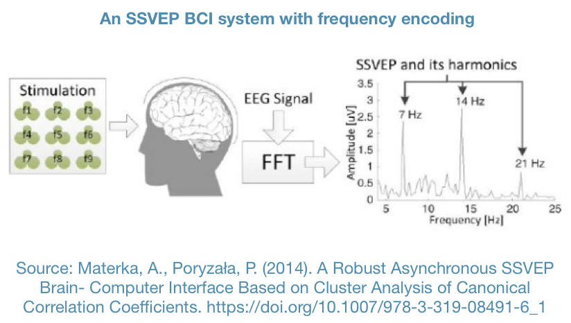
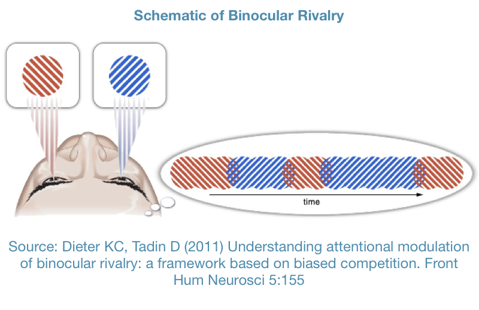
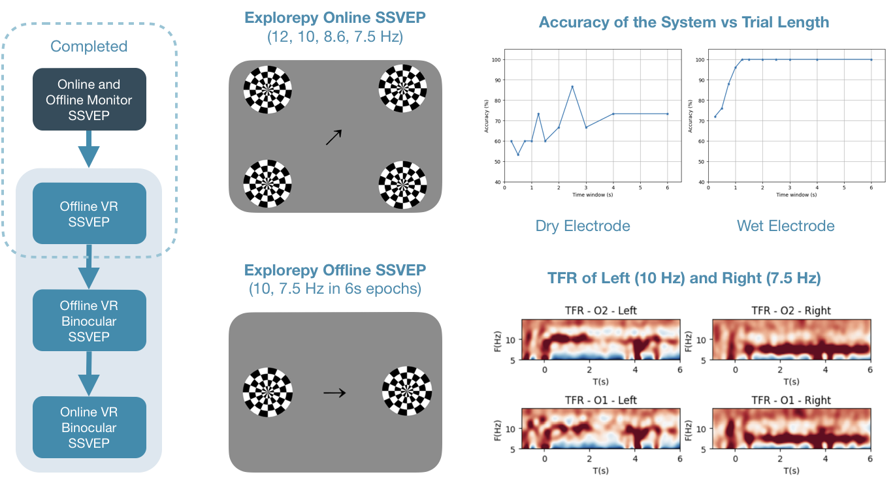
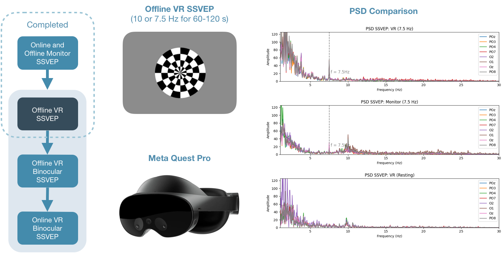
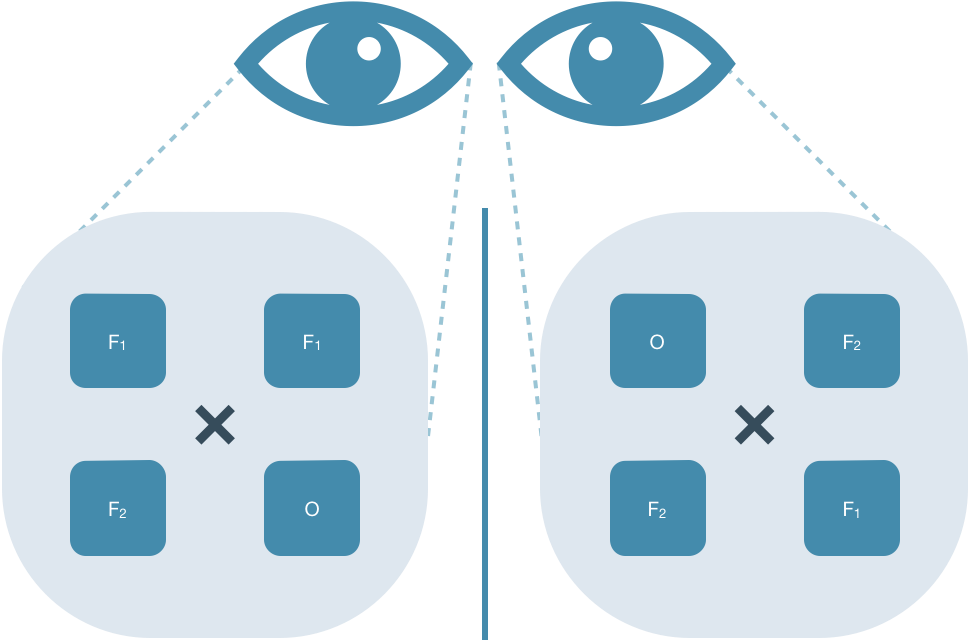

# ***Evaluating a Binocular SSVEP Paradigm in Virtual Reality***

# **Intermediate Presentation**

## **1. SSVEP Principles**
### 1.1 Overview
- Fixating on a flickering stimulus target generates a corresponding and measurable frequency response
- SSVEP based BCI systems have high ITR and require little training 
- Limited frequency band results in a limited number of targets
 

### 1.2 Dual SSVEP
- Dual-frequency SSVEP produces a higher number of visual stimuli using a limited number of frequencies
- Unpredictable intermodulation of harmonic components: 
$a \cdot f_1 + b \cdot f_2$

### 1.3 Binocular Vision
- Binocular Rivalry: different images presented to each eye compete for perceptual dominance, leading to spontaneous shifts in perception
- Utilising this visual phenomenon we will try to maximise the number of visual stimuli produced by two frequencies.

## **2. Progress Update**
### 2.1 Monitor SSVEP

### 2.2 Offline VR SSVEP

## **3. Detailed Plan**
### 3.1 Metrics
- Information Transfer Rate (ITR): speed of information conveyed from the user's brain to the computer system
- Signal-to-Noise Ratio (SNR): signal quality from the user's brain activity
- Accuracy: system’s ability to correctly classify the user's intention based

### 3.2 Experiment Design
Minimalistic representation of the experiment design.
- Frequencies & electrode placement from literature
- Different Visual Stimuli per Eye

### 3.4 Canonical Correlation Analysis (CCA)
CCA identifies the association between two sets of random variables $X$ and $Y$ 
It seeks vectors $\mathbf{a}$ and $\mathbf{b}$ such that maximise $p = \text{corr}(\mathbf{a}^\intercal X, \mathbf{b}^\intercal Y)$

The instantaneous probability of stimulus frequency $i$ can be formulated as follows: $P_{r_i}=\frac{p_{i}}{M}$ and $M = \frac{1}{n}\sum_{j=1}^{n}p_{j}$

After $m$ sub-trials coefficient $S_{f}^{m}$ denoting probability of stimulus frequency $f$ can be calculated as follows: 
$S_{f}^{m}=Pr_{{f}}^1\times Pr_{{f}}^2\times \ldots \times Pr_{{f}}^{m-1}$
